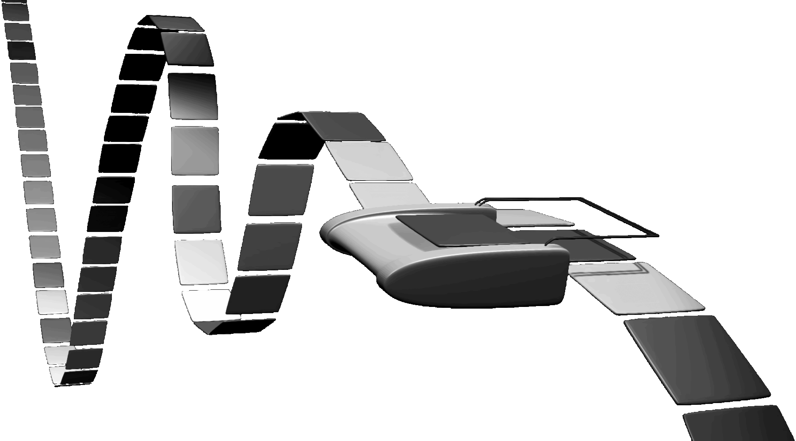

# Lab 7: RV64 MMIO & VFS

> 本次实验是 bonus，并且只需要提交实验代码，不需要提交实验报告

## 1 实验目的
* 认识 RISC-V 中的 MMIO 机制，利用 MMIO 完成 UART 串口输出
* 理解 VFS 虚拟文件系统，实现用 `write` syscall 实现不同功能

## 2 实验环境

* Same as previous labs.

## 3 背景知识

### 3.1 MMIO

我们在《计算机组成与设计》中第一次认识了 RISC-V 指令集，并且实现了一个简单的 MCU。但是你应该也已经发现了，RISC-V 指令集中并没有用于完成输入输出的专用指令。例如当你想将一个寄存器的值输出到某块屏幕或者串口上，可并没有一条指令能替你做这件事。但是我们常说 **There is no magic in programming.** 在系统编程领域，这句话依然成立。在 Bonus 的第一部分，你将会认识指令集是如何与外部设备进行交互的，并使用最简单的设备 UART (Universal Asynchronous Receiver-Transmitter) 来实现字符输出。

### 3.1.1 图灵机与 I/O

大家都学习了《计算理论》课程，了解了如今的计算机都是基于图灵机架构的，RISC-V 指令集架构的计算机也不例外。但是回想起来，图灵机与如今的计算机有着显著的差别——图灵机缺失了我们**直觉上**的**输入**和**输出**功能。



图灵机的“输入”是一条带有程序的纸带，而将最后的“输出”也写在纸带上。而纸带在如今的计算机中被实现成了内存，我们可以看到纸带上填写的内容，却没有办法直接看到内存中存储的内容。如果完全按照图灵机来实现计算机，就得通过给 DRAM 中的内存充电来编程，用万用电表来读取程序的输出了，这可比敲键盘看显示器来得困难多了。这是因为我们看到的计算机不是一台裸露在外的图灵机，而更像是一台被装在盒子里的图灵机，我们得用复杂的手段才能直接给图灵机输入纸带或者读取纸带上的输出。

为了解决交互困难的问题，计算机科学先驱们进行了两种实现，**Port Mapped I/O** 与 **Memory Mapped I/O (MMIO)**。

### 3.1.2 Port Mapped I/O

首先很容易想到的是，我们给图灵机加上一些小功能，除了原本的计算以外，我们在图灵机的转移函数中定义新的运算，并给图灵机增加一条裸露在包裹图灵机的盒子外的输入输出专用纸带，图灵机可以读取这条纸带上的内容作为，也可以在这条纸带上写东西作为输出。因为这条纸带是裸露在外的，所以可以更轻松地与操作人员或者其他设备进行交互。

于是新的抽象诞生了，我们用新的专用指令来作为转移函数中新定义的部分，并用 Port 空间作为新增加的裸露在外的纸带。


ISA 通过 `out` 指令来将值写到某个连接在 Port 总线上的设备寄存器上，这样设备就能够发现自身内部有寄存器被改写了，做出对应的响应。例如我们要打印某个字符，就向串口所在的 Port 写上我们要输出的字符，然后这个值再由其他电路控制显示到屏幕上，而无需 CPU 再插手显示的过程。这就像图灵机用我们新定义的运算在裸露在外的纸带上写了内容，可以被直接观察到。

相似的 `in` 指令来读取外部设备寄存器上的值，就像读取裸露纸带上操作人员写的值或是其他设备写的值一样。

### 3.1.3 Memory Mapped I/O

但是我们实现的 RISC-V 的子集里显然没包括类似的指令，在实验中也没有用到过，所以 RISC-V 是怎么实现输入输出的呢？

我们还有别的方法来进行实现，比如我们将纸带的某些部分替代成专用的传感器，再将纸带的其他某些部分替换成可以由外部控制值的控制器。这样我们在换成了传感器的部分写上值的时候，这个值就能够被输出到包裹图灵机的盒子外部；并且我们可以在外部通过控制器控制纸带上的某些值，这样就能够对图灵机进行运行中的输入了！

当我们阅读 QEMU 的源码 `/hw/riscv/virt.c` 的时候（virt 正是我们整个实验里选择的机器型号，由 `-machine virt` 进行指定），可以看到模拟器中有一大段定义：

```c
static const MemMapEntry virt_memmap[] = {
    [VIRT_DEBUG] =        {        0x0,         0x100 },
    [VIRT_MROM] =         {     0x1000,        0xf000 },
    [VIRT_TEST] =         {   0x100000,        0x1000 },
    [VIRT_RTC] =          {   0x101000,        0x1000 },
    [VIRT_CLINT] =        {  0x2000000,       0x10000 },
    [VIRT_ACLINT_SSWI] =  {  0x2F00000,        0x4000 },
    [VIRT_PCIE_PIO] =     {  0x3000000,       0x10000 },
    [VIRT_PLATFORM_BUS] = {  0x4000000,     0x2000000 },
    [VIRT_PLIC] =         {  0xc000000, VIRT_PLIC_SIZE(VIRT_CPUS_MAX * 2) },
    [VIRT_APLIC_M] =      {  0xc000000, APLIC_SIZE(VIRT_CPUS_MAX) },
    [VIRT_APLIC_S] =      {  0xd000000, APLIC_SIZE(VIRT_CPUS_MAX) },
    [VIRT_UART0] =        { 0x10000000,         0x100 },
    [VIRT_VIRTIO] =       { 0x10001000,        0x1000 },
    [VIRT_FW_CFG] =       { 0x10100000,          0x18 },
    [VIRT_FLASH] =        { 0x20000000,     0x4000000 },
    [VIRT_IMSIC_M] =      { 0x24000000, VIRT_IMSIC_MAX_SIZE },
    [VIRT_IMSIC_S] =      { 0x28000000, VIRT_IMSIC_MAX_SIZE },
    [VIRT_PCIE_ECAM] =    { 0x30000000,    0x10000000 },
    [VIRT_PCIE_MMIO] =    { 0x40000000,    0x40000000 },
    [VIRT_DRAM] =         { 0x80000000,           0x0 },
};
```

可以看到这个物理内存模型其实与加上了“传感器”和“控制器”的纸带非常类似，其中某些段被换成了控制器，某些段被换成了传感器。

1. 例如我们在本次实验中会用到的 `VIRT_UART0`，就是一个最简单的传感器，往这段物理内存空间里面写字符，就会由 CPU 外的其他电路来将写入的信号进行编码后进行输出。同时它也是一个控制器，CPU 可以从中读取其他设备输入后被保存在寄存器中的值，作为计算过程中的输入。
2. `VIRT_RTC` 也是一个传感器，是我们之前进行调度的基础，这是一个时钟中断发生器，当我们向这段内存空间中写入值时，其实是写进了中断发生器的一个寄存器里，然后中断发生器会递减这个寄存器中的值，当归零时，向 CPU 发送请求来引发时钟中断。
3. 而 `[VIRT_DRAM] = {0x80000000, 0x0}` 则表示这段 DRAM （我们常说的内存）不限制空间大小。它就像原本的纸带一样能够延伸到无限长，作为图灵机用于计算的空间。

### 3.2 UART

> 以下内容摘自 WikiPedia

通用非同步收發傳輸器（Universal Asynchronous Receiver/Transmitter，通常稱為 UART ）是一種非同步收發傳輸器，是電腦硬件的一部分，將數據通過串列通訊進行傳輸。UART 通常用在與其他通訊介面（如 EIA RS-232）的連接上。

具體實物表現為獨立的模組化晶片，或是微處理器中的內部周邊裝置 (peripheral)。一般和 RS-232C 規格的，類似 Maxim 的 MAX232 之類的標準訊號振幅變換晶片進行搭配，作為連接外部裝置的介面。在 UART 上追加同步方式的序列訊號變換電路的產品，被稱為 USART (Universal Synchronous Asynchronous Receiver Transmitter)。

> 省流：CPU 把值写进 UART 的寄存器里，UART 就会把这些值编码后传输出去。只要用专用的控制器进行接收，就能够显示在屏幕上。而 QEMU 已经帮我们实现好了所有部分，我们只负责写寄存器就行。

### 3.3 VFS


## 4 实验步骤

### 4.1 Say Goodbye via UART

经过前面的介绍，我们已经知道，只要往某个物理地址写入值，这个值就会被写进 UART 的寄存器里，然后被传输出去后进行输出。而在 QEMU 中这个物理地址是 `VIRT_UART0` 的起始地址，也就是 `0x10000000`。

本次实验的第一部分，你需要通过向这个地址依次写入字符，实现输出 `[S] 2023 Bye oslab!\n`，下面你将在 `init/main.c` 中输出了 `[S] 2022 Hello RISC-V` 后紧接着调用 `bye();` 来输出这句话。


```c
void bye() {
    // create the mapping from 0x10000000 to 0x10000000 (4.1.1)
    // do the print (4.1.2)
}
```

#### 4.1.1 建立映射

因为启用了虚拟内存，所以我们没法直接对某个物理地址进行访存。所以必须建立起映射，例如，你可以等值映射：`0x10000000 -> 0x10000000`. 这样往虚拟地址 `0x10000000` 写的值就会被写入物理地址空间的位置 `0x10000000` 了，而这个位置对应的就是 UART 的寄存器。

#### 4.1.2 进行输出

建立好了映射以后，就可以往寄存器里写值了！说是寄存器，但是由于是外部设备的寄存器，并且我们使用的 RISC-V 架构使用了 MMIO 来作为访问外设的方式，所以我们直接做 

```c
*(volatile unsigned char *) 0x10000000 = c;
```

时，就会把字符 `c` 的值写入寄存器，这个字符就会出现在我们运行 QEMU 的终端里了。所以需要做的事是遍历字符串，将其中的每一个字符都写入 `0x10000000` 这个地址。

### 4.2 VFS 实现

```rust
todo!();
```

## 5 实验提交

只需将本次实验的代码打包上传。如果没有完成所有内容将按一定比例加分。

> 本实验指导中的图片来源于 WikiPedia, https://www.felixcloutier.com/x86/out