# lab0

### 安装必要的软件包

首先升级wsl到2，并升级Ubuntu到22.04，并安装必要的软件包。由于忘记截图，我简略描述问题。一个是国外源不稳定，一个是源版本没有对应，导致一堆错误。过程繁复，不再赘述。总之最终是安装完了。

    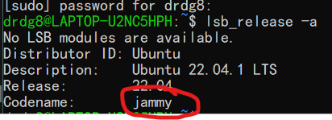 
    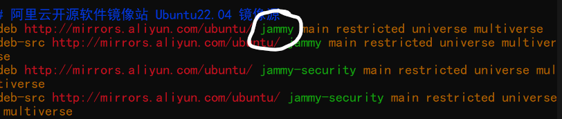

### 之后将仓库克隆到本地，并下载linux内核

我将linux内核直接放在os22fall-stu目录下了,路径为:

> /home/drdg8/os22fall-stu/linux-6.0-rc5

    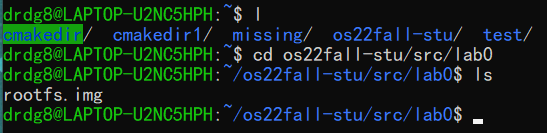 
    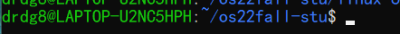

    可以看到根文件系统的镜像已经在目录里了。

### 将linux内核解压并编译

在第一次构建时，我直接用了``defconfig``，默认是没有调试信息的，所以在后面做gdb调试时，``n/p/display``等命令都不能实现。因此在最后重新构建linux kernel时，加上调试信息选项后就能正常使用了。

    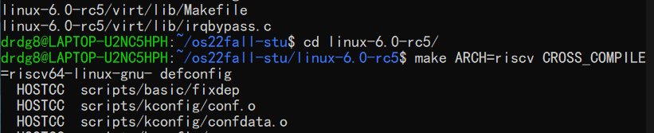 
    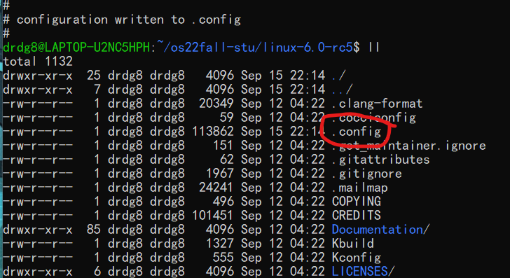 
    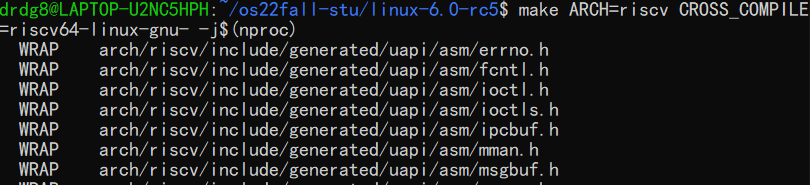

查阅``make help``信息可知，``ARCH=``指定架构，``CROSS_COMPILE=``指定交叉编译选项。前一个命令是生成默认配置，后一个命令是构建内核。

### 使用QEMU调试内核

根据我的下载路径将命令改成如下:

> qemu-system-riscv64 -nographic -machine virt -kernel /home/drdg8/os22fall-stu/linux-6.0-rc5/arch/riscv/boot/Image -device virtio-blk-device,drive=hd0 -append "root=/dev/vda ro console=ttyS0" -bios default -drive file=/home/drdg8/os22fall-stu/src/lab0/rootfs.img,format=raw,id=hd0

    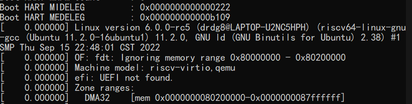

可以看到，内核已经正常运行了起来。截图是内核信息。

### 使用GDB调试内核

在上一步直接运行gdb调试功能时：

> gdb-multiarch /home/drdg8/os22fall-stu/linux-6.0-rc5/vmlinux

发现连接不上，显示``connection timed out``:

    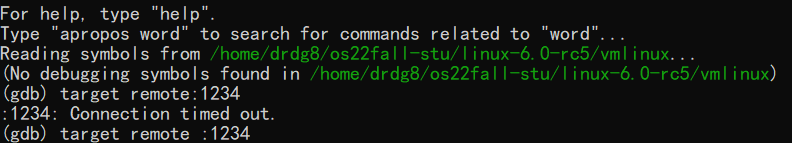

仔细检查发现，原来是没有加``-S -s``，其中``-S``表示暂停CPU执行，``-s``表示tcp:1234开放：

> qemu-system-riscv64 -nographic -machine virt -kernel /home/drdg8/os22fall-stu/linux-6.0-rc5/arch/riscv/boot/Image -device virtio-blk-device,drive=hd0 -append "root=/dev/vda ro console=ttyS0" -bios default -drive file=/home/drdg8/os22fall-stu/src/lab0/rootfs.img,format=raw,id=hd0 -S -s

    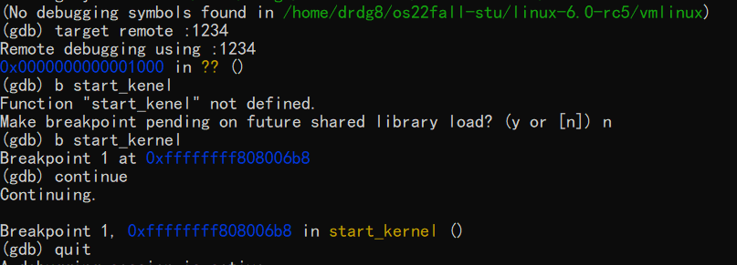

命令改好后就能正常调试了。

### 使用各种命令

在默认生成的内核中没有调试信息，所以``n/p/display``等命令都不能正常使用.

    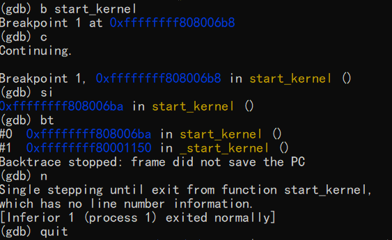 
    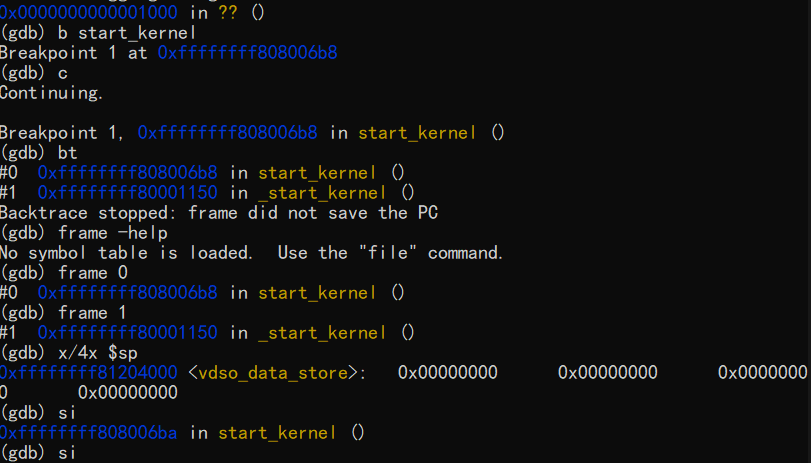 
    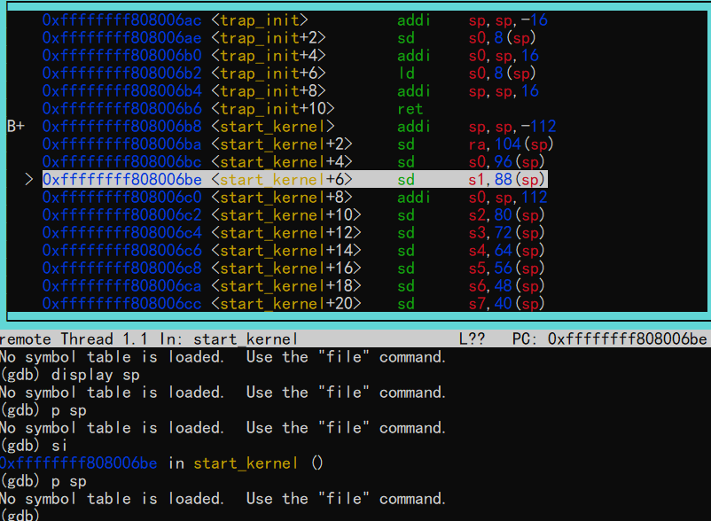

报错因为是gcc编译,编译选项中没有开启-g，所以编译信息不足。

第三步上方的汇编代码是``layout asm``命令生成的。

可以看到，``backtrace/break/strp instruction/continue``等等命令都可以使用，许多命令的使用方法由于实验指导里说的很详细了，我就不再赘述。

    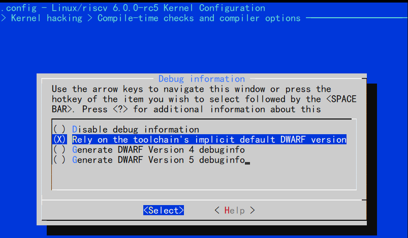 
    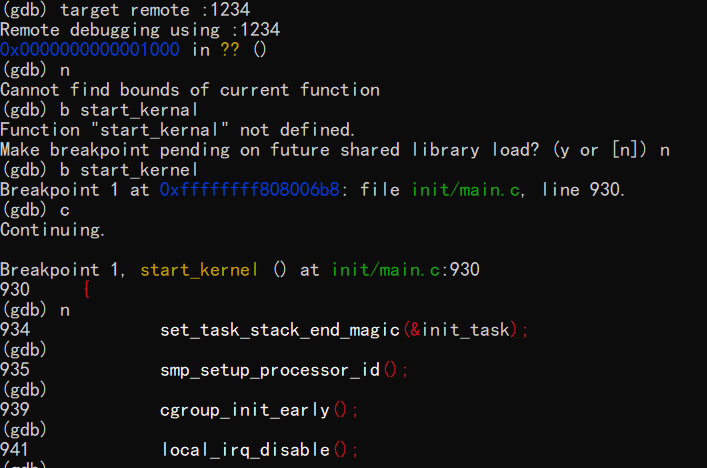 
    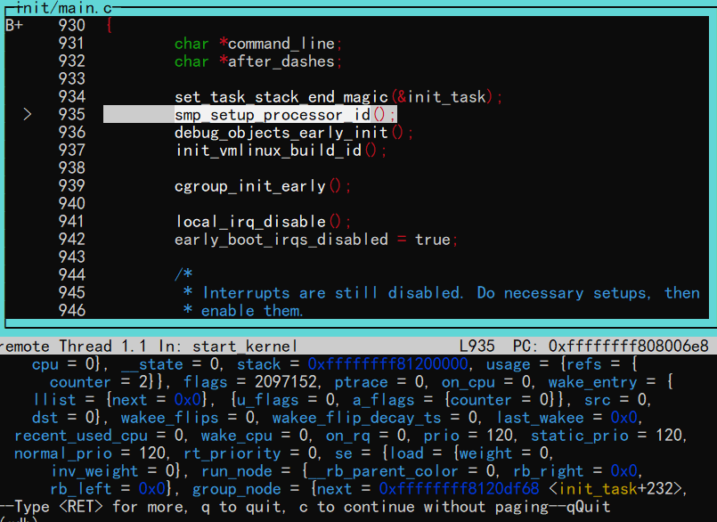

之后重新用``make ARCH=riscv CROSS_COMPILE=riscv64-linux-gnu- menuconfig``生成内核的.config文件，并在上图一的设置中改成``rely on the toolchain's implict default DWARF version``就可以了。

可以看到，``n/p``等命令都可以使用了，其中上图二也能显示file地址与函数名称了，上图三是使用``p init_task``的结果。

到此，试验任务完成。

## 思考题

1. 使用``riscv64-linux-gnu-gcc``编译单个``.c``文件

    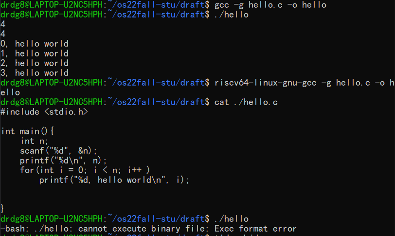

上图中，我分别用``gcc``与``riscv64-linux-gnu-gcc``编译了一个``hello.c``，可以看到直接用``gcc``编译的可执行文件可以直接执行，而``riscv64-linux-gnu-gcc``编译的则不能，报错``Exec format error``.这是``x86``的架构不能执行``ARM``也就是``RISCV``指令集产生的文件。

2. 使用``riscv64-linux-gnu-objdump``反汇编 1 中得到的编译产物

    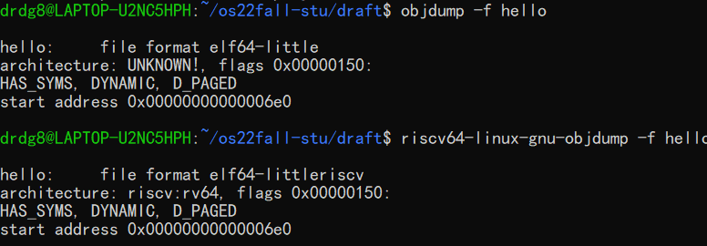

可以看到objdump都能反编译文件，但riscv64的能检测出架构。

3. 调试Linux:

a. 使用 layout asm 显示汇编代码

    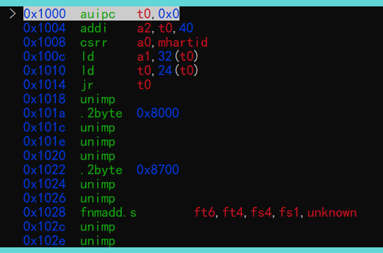

b.c.d.e. 用 b * 0x80000000 设下断点，用 info breakpoint(i b) 查看断电， 用 del 2 来删除第几个断点。
    

    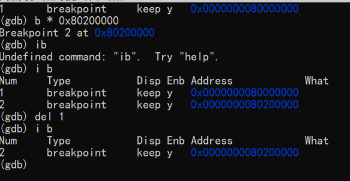

f.g.h. 之后continue到指定断点，用si可以执行单条指令，但n不行，提示``cannot find the bounds of function``。这是之前默认配置时做的。

    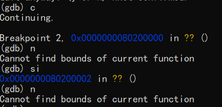

4. 用``make``清除构建产物

查询``make help``可知，``make distclean``能清除配置文件与构建产物.

    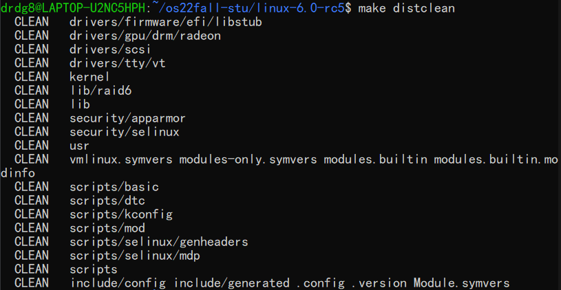

5. vmlinux 和 Image 的关系和区别是什么？

这是网上查到的信息：

> vmlinux：Linux内核编译出来的原始的内核文件，elf格式，未做压缩处理。
> Image：Linux内核编译时，使用objcopy处理vmlinux后生成的二进制内核映像。

> Image: The generic Linux kernel binary image file.
> vmlinux: This is the Linux kernel in a statically linked executable file format.

在之前的实验中，我们在直接运用根文件系统或者qemu启动linux时，用的是image格式，而用gdb调试时则用的时vmlinux，因此，vmlinux一定包含着更多的调试信息，便于我们学习。

