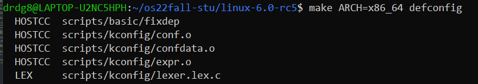
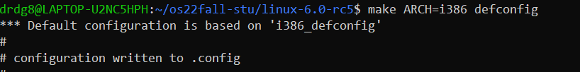

# lab1

## 实验步骤

1. 编写head.S

首先，要初始化sp，stack就在 `.bss.stack`代码段，所以我们使用la指令将sp设置为 `boot_stack_top`的地址。之后初始化s0,并且存储ra的值，再用 `jal ra start_kernel`跳转到 `main.c`里的 `start_kernel`。这样，`head.S`就编写好了。

    

可以看到，我使用的是la伪指令设置sp的值，由下图可以看到la指令实际上是auipc与addi两条指令融合的，但是之前我直接使用 `auipc sp, %hi(boot_start_top)`与 `addi sp, sp, %lo(boot_start_top)`，却报错如下图。看报错，原来是 `R_RISCV_HI20`是32位的高20位，不能直接用在这里。

    
    

2. 完善Makefile

这个就比较简单了。模仿 `init/Makefile`的写法写一个相似的即可。如下图。其中wildcard表示符合 `*.c`的所有文件，sort排序，patsubst是将文件中符合第一个条件的部分替换成第二个条件的形式。`.PHONY`表示抽象的目标，`$<`表示第一个传入的文件。这些都在Makefile教程中有，不加赘述。

    

3. 补充sbi.c

这里有个坑，如果你直接使用 `mv a0, %[arg0]\n`与 `[arg0] r (arg0)`这种形式，编译运行都是正确的，但是objdump之后你会发现寄存器是乱的，如下图。圈出来的地方a6与a7赋成一样的值了。编译器似乎并没有保护寄存器。

    
    

所以我们需要用 `ld a0, %[arg0]\n`与 `[arg0] m (arg0)`直接从内存取值，从而避开寄存器的使用，如下图，可以看到现在的值都是正常的了。

    
    
    

4. 完成 `puti()`与 `puts()`

注意，这里的puti定义最好改成 `uint64`,不然显示不出64位的寄存器。思路都很直接，就不解释了。

    

5. 修改 `defs.h`

这一步也是简单的，只要找到对应的伪指令，再和 `csr_write`对比就可写出来。

    
    

6. 交叉编译工具链的安装与中间产物的获得

只要按照步骤来即可，不多赘述，由于思考题5需要生成 `arch/arm64/kernel/sys.i`，只要把后面的 `path/to/file`改成这个即可。

    
    

## 思考题

1. 请总结一下 RISC-V 的 calling convention，并解释 Caller / Callee Saved Register 有什么区别？

就是把要传入的参数放到对应的寄存器里，a0-a7分别对应传入的7个参数，然后跳转到被调用的函数，一般用 `jal ra, Func1`指令。

    

对于 Caller / Callee Saved register，可以看下图：

    

根据定义，需要被caller saved 的就是caller saved register，有ra等。对于Callee Saved Register，也有sp,s0等。

2. 编译之后，通过 System.map 查看 vmlinux.lds 中自定义符号的值.

    

可以看到，被定义的值都在System.map里列出来了。

3. 用 csr_read 宏读取 sstatus 寄存器的值，对照 RISC-V 手册解释其含义。

我将 `main.c`加入了csr_read部分，并改变了puti的参数为uint64,如下图。之后跑出来结果是一长串数字,也就是0x8000000000006000。

    
    

查看sstatus的定义，如下图，可以看到是 `SD = 1, FS = 11`.再看定义，FS处于dirty状态。FS代表浮点寄存器是dirty的，需要先写出原先寄存器的值,再将FS置为clean状态，从而可以向内写值。SD是快速校验位，如下图。其当FS或者XS为11时置1.

    
    
    

其他的`WPRI UXL MXR SUM SPP SPIE UPIE SIE UIE`符号位都是0.其中`WPRI`是`Write Preserve Read Ignore`，`SPIE SIE / UPIE PIE`表明interrupt在User/Supervisor层面是否启用以及权限，在这里都是0，也就是没有启用interrupt。`SPP`表明interrupt的来源，如果是user mode则置0；`SUM`表示`permit Supervisor User Memory access`也就是Supervisor mode是否能够连接User mode的page，置0表示不可以。`MXR`表示`Make eXecutable Readable`，置0表示load的page是只读的。`UXL`表示寄存器长度。这些都能在`riscv-priviliged`中查到。

    
    
    

4. 用 csr_write 宏向 sscratch 寄存器写入数据，并验证是否写入成功。

我们改变main.c,放入csr_write，如下图，得到结果，其中数字是0x8020000的十进制。

    
    

5. Detail your steps about how to get arch/arm64/kernel/sys.i

请看6. 实验步骤，最后结果如下所示。

    

6. Find system call table of Linux v6.0 for ARM32, RISC-V(32 bit), RISC-V(64 bit), x86(32 bit), x86_64 List source code file, the whole system call table with macro expanded.

首先，在[linux-cross-reference](https://elixir.bootlin.com/linux/latest/A/ident/sys_call_table)中搜索sys_call_table，可以看到sys_call_table都在哪里定义的。

    

对于arm，搜索之后发现应该下载`gcc-arm-linux-gnueabi`,之后`make ARCH=arm CROSS_COMPILE=arm-linux-gnueabi- defconfig`，

    
    

直接搜没有搜到sys_call_table,我们看`entry-common.S`有提及。于是生成看看。

    
    

在文档中搜索，果然找到了对应的sys_call_table。

    

对于riscv(32 bit)，得从[网站](https://github.com/riscv-collab/riscv-gnu-toolchain)上先下载工具链`gcc-risc32-linux-gnu`,由于从源码编译`.gitmodule`子模块下不下来，我直接使用了ubuntu2020版的工具链，似乎基本功能也可以用。

    

之后
`make ARCH=riscv CROSS_COMPILE=/home/drdg8/riscv/bin/riscv32-unknown-linux-gnu- defconfig`
再
`make ARCH=riscv CROSS_COMPILE=/home/drdg8/riscv/bin/riscv32-unknown-linux-gnu- arch/riscv/kernel/syscall_table.i`
这样，就能得到其sys_call_table。

    
    
    

对于riscv(64 bit)，实际上和riscv32一样。先
`make ARCH=riscv CROSS_COMPILE=riscv64-linux-gnu- defconfig`
再
`make ARCH=riscv CROSS_COMPILE=riscv64-linux-gnu- arch/riscv/kernel/syscall_table.i`
就能得到想要的结果。

    
    

对于x86(64 bit)，由于ubuntu使用的就是x86_64的架构，所以不需要交叉编译，直接编就行。先
`make ARCH=x86_64 defconfig`
再
`make ARCH=x86_64 arch/x86/entry/syscall_64.i`

    
    
    
    

对于x86(32 bit)，由于x86_64的编译器也能编译x86_32的文件，所以不用下载工具链。先
`make ARCH=i386 defconfig`
再
`make ARCH=i386 arch/x86/entry/syscall_32.i`
就能得到想要的结果。

    
    
    

7. Explain what is ELF file? Try readelf and objdump command on an ELF file, give screenshot of the output. Run an ELF file and cat /proc/PID/maps to give its memory layout. 

`ELF(Executable and Linkable Format)`，是一种可执行可连接的文件格式。
首先编写一个lab1.c文件，如下图。再用gcc编译，查看lab1的格式，就是ELF。

    
    
    

下图是objdump与readelf的结果。

    
    

之后将lab1运行并挂起，查看memory，可以看到，就像老师上课讲的一样，有`.data .rodata .text .stack`等段，由于是动态链接，中间还有一些动态库。

    

