# lab2

### 4.2 开启trap处理

简单来说，就是处理`head.S`中的`_start`逻辑：

1. 首先是`set stvec`，这只需用`la`获得`_traps`，再用`csrw`写入`stvec`即可。

2. 之后是设置`sie`的`STIE`位，这一位在第5位，所以我们利用`csrs`命令将第5位置1。注意不能用`csrsi`命令，因为其只支持5位imm的0扩展，也就是只能管到第4位。

3. `set first time interrupt`，只要调用`clock_set_next_event()`即可。注意，一定要提前设置好`sp`的值，不然会调用错误。这也是我踩的坑。

4. 设置`sstatus`的`SIE`位为1，也是用`csrsi`即可。

    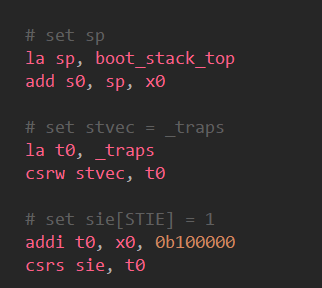 
    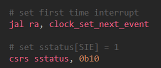

- 最好在完成 `set first time interrupt`之前检验`sie`和`sstatus`是否设置正确。

    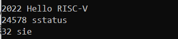 

### 4.3 实现上下文切换

实现`_trap`的上下文。

1. 先实现上下文切换逻辑，保证`save`和`restore`的正确实现。因此我们先存储并取出32个`reg`和`sepc`的值。`sepc`用`csrr`读出，注意等`t0`存好后再使用，同样等`sepc`取出后再取`t0`.最后取`sp
`。

    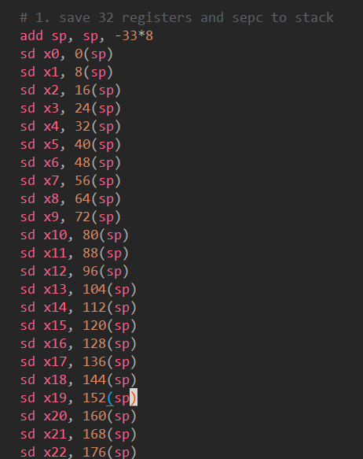 
    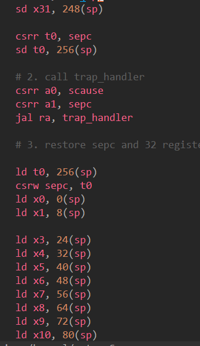 
    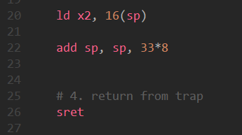

2. 之后，我写了测试代码简单改变了`x0-x31`的值用来验证，看结果说明正确写好了。

    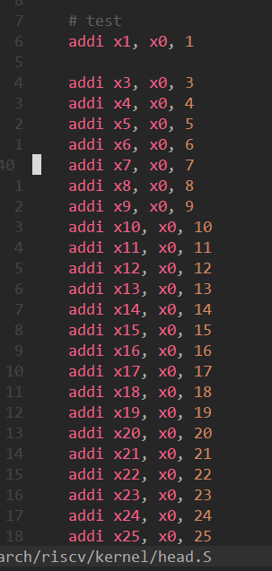
    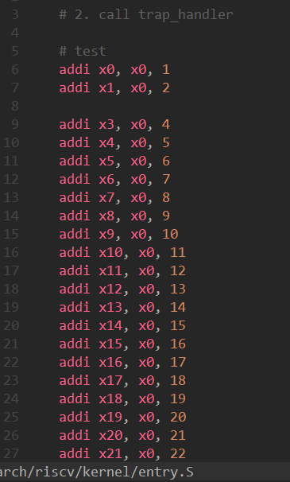 
    

3. 验证上下文切换正确后，再实现`call trap_handler`。实际上就是把`scause`和`sepc`分别读入`a0`和`a1`，再`jal ra, trap_handler`.

4. 还有一点，当你load出sp的时候，一定要记得加上之间的33*8，否则栈顶的位置就不对了，这是我之后发现的坑。

4. 注意，最后的return应该是`sret`，因为这是在内核层面上的。

### 4.4 实现 trap 处理函数

查看`scause`相关信息，可以知道我们要处理的是`interrupt`置1,`exception code`置5的情况，于是我们先实现`pow`函数，再分别判断`interrupt`与`exception code`。

    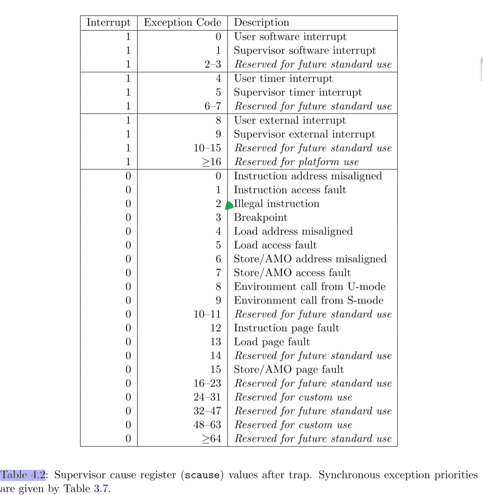
    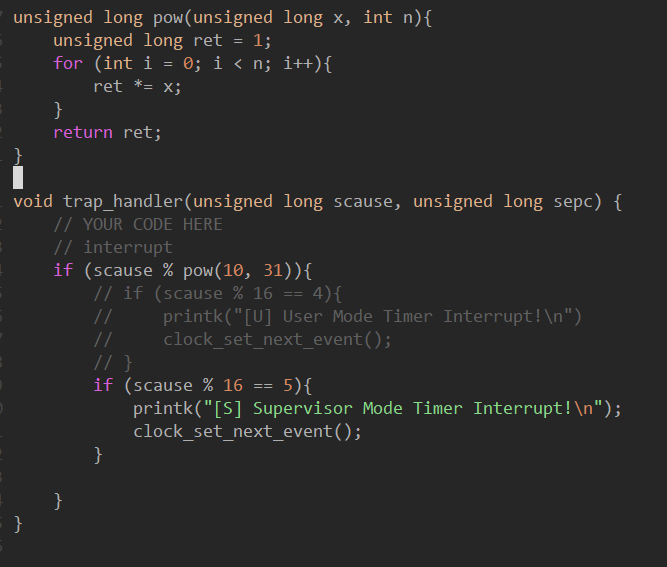

### 4.5 实现时钟中断相关函数

`get_cycles()`用`rdtime`拿到时间，`clock_set_next_event()`调用`sbi_ecall()`设置时钟中断。都很简单，不加赘述。

    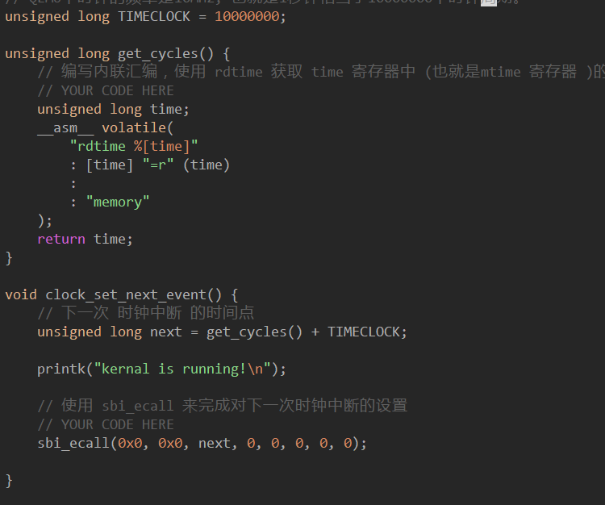

### 4.6 编译测试

可以看到，结果符合要求。注意，根据助教群的说法，这个`kernel is running`是在test循环中的，于是我改了CLK为100，结果如下图所示。

    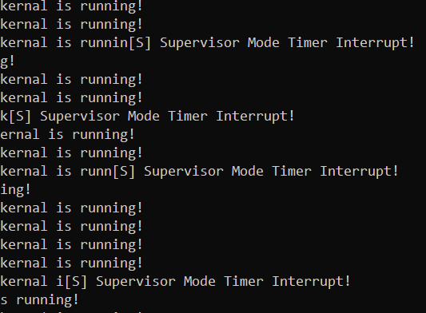

## 思考题

1. 查看 RISC-V Privileged Spec 中的 medeleg 和 mideleg 解释上面 MIDELEG 值的含义。

看解释，是指哪些`execption`或者`interrupt`被委托给`S-Mode`执行。
`interrupt`低16位是0000 0010 0010 0010，也就是第1,5,9位，也就是`Supervisor`的`software / timer / external interrupt`交给`S-Mode`处理;
`exception`低16位是1011 0001 0000 1001，也就是第0,3,8,12,13,15位，也就是对应的交给`S-Mode`处理;

    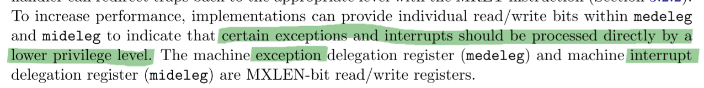
    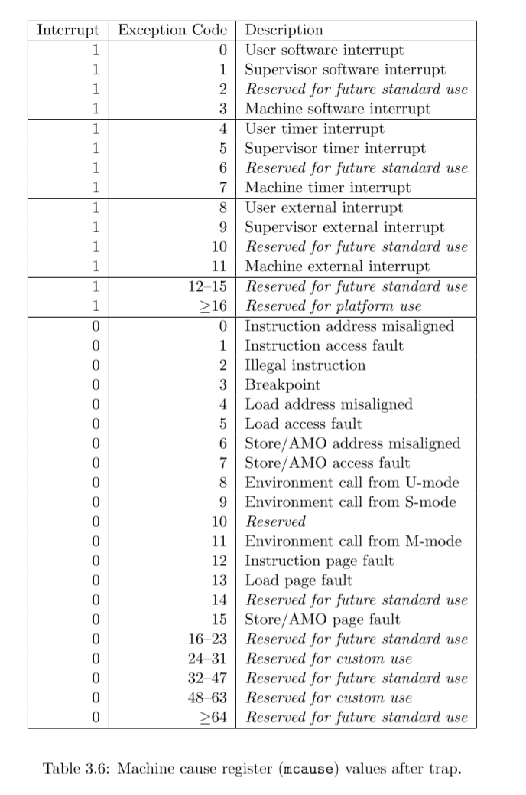

