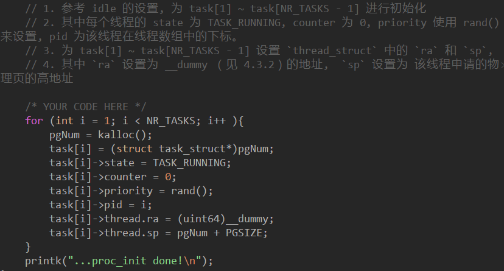
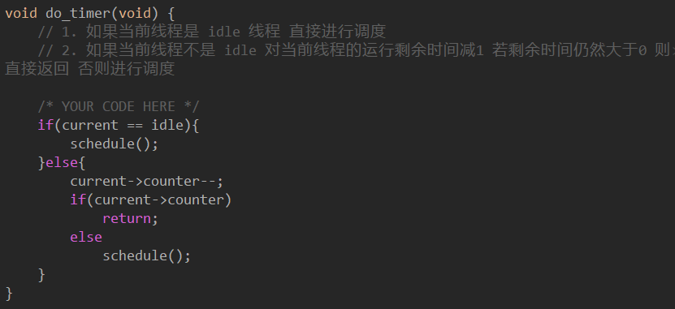

# lab3

### 实验过程

#### 4.3 线程调度实现

##### 4.3.1 线程初始化

首先是task_init函数。其分为两个部分，一是idle的初始化，因为其代表了空闲，因此不需要设置pc和ra，priority和counter也设置为1即可。而对于地址空间的分配，我们只要调用mm.c中的kalloc函数，就能返回一个地址，我们将其强转成struct task就可以向内分配地址。同理，其他31个进程也可以这么设置，只不过ra需要设置在__dummy，sp指向kalloc返回的地址加上PGSIZE处。这样我们的task_init就设置完成了。

     
     

之后，我们将task_init和mm_init放入head.S中，将其初始化。

     

之后，我们查看结果，可以看到成功初始化了。

     

##### 4.3.2 entry.S 添加 __dummy

由于创建一个新的线程是没有上下文需要被恢复的, 所以我们需要为线程第一次调度提供一个特殊的返回函数 __dummy。 这个函数只要将sepc设置为__dummy，并使用sret返回即可。

如果是正常的进程切换，则是要将下一个函数的ra load出来，再返回switch_to到schedule再到do_timer最后返回时钟中断最后在_trap中设置sepc并使用sret返回，我们只是将这个过程提前而已。以下是实现的代码。

     

##### 4.3.3 实现线程切换

首先是switch_to的实现。注意，当调用__switch_to转换reg的时候，记得task_struct的其他成员如pid等也要改变，不然就会出现reg变了，PID没变的情况，如下图所示。tmp也就是为了存储current现在的地址用于context switch.

     
     

之后是context switch的实现，也就是__switch_to。我们传入的是task_struct，距离thread_struct还要加一个offset，如下图所示。之后再将一个寄存器存入内存即可。

     
     
     

##### 4.3.4 实现调度入口函数

我们要实现timer并在时钟中断中调用，实现并不难，但要注意时钟调用的位置，一定要clock_set_next_event之后再调用，因为第一次调用时不会返回do_timer，所以下一次时钟周期一定要提前设置好。

     

##### 4.3.5 实现线程调度

###### 4.3.5.1 短作业优先调度算法

SJF（shortest job first），简单明了，用min记录最小值，遍历线程指针数组task，TASK_RUNNING状态下counter最少的线程下一个执行。如果min没有变, 用rand()随机赋值counter,之后再重新进行调度。

     
     

###### 4.3.5.2 优先级调度算法

linux v0.11的做法，在最后counter赋值的时候变一下，用之前counter的一半加上priority即可。可以看到调度和set都是符合要求的。

     
     
     
     

### 思考题

1. 在 RV64 中一共用 32 个通用寄存器, 为什么 context_switch 中只保存了14个?

因为context_swtich是被schedule调用的，因此其作为callee只需保存callee需要保存的寄存器即可。下图就展示了callee需要保存的reg，其中就有13个。而ra则是作为context_switch实现的核心，会随着进程改变而改变，因此旧值也需要保存。

    

2. 用gdb追踪一次完整的线程切换流程, 并关注每一次 ra 的变换 (需要截图)

首先是第一次进入switch_to，可以看到ra是schedule的最后位置。再进入__switch_to，可以看到现在的ra是switch_to函数。

     

之后在__switch_to进行context switch之后，可以看到现在的ra就是新进程里的__dummy了。

经过__dummy之后, 由于sepc被设置为dummy, 并使用sret, pc就返回dummy循环, 直到下次时钟interrupt, 其从dummy中进入_traps, 这也是为什么下一次_traps存储的ra是dummy的原因. 

sret返回sepc, ret返回pc.

从理论来说, __dummy中sepc设置成dummy, pc跳转到dummy, 相关的sp, a0/a1之类的也需要跟着改变, 但实际上由于dummy不需要参数, sp也是用的内核栈, 需要caller修改的寄存器都可以置0, 因此只需要修改pc即可. 

     

再第二次进入switch_to，可以看到前一个进程的ra还在switch_to函数中。

     

之后进行完context switch之后，可以发现ra不是指向__dummy了，而是上次没做完的switch_to.

     

switch_to出来后进入schedule的末尾，再进入do_timer，trap_handler,最后从_trap出来，load出下一个进程的ra,也就是dummy

     
     
     

3. 运行课堂 demo 的 hello-lkm 代码, 回答下列问题:

a. 对运行结果进行截图, 展示同一进程内的线程哪些数据 share, 哪些不 share

- 首先，将其解压后，将路径修改成解压linux内核的路径：

     

- 之后过程略过不谈，最后结果:

     

- 其中，看PID = 1/173的线程，TSK / PID / STACK / COMM是不共享的，MM与ACTIVE_MM是共享的。

b. 安装 lkm 和 remove lkm 的命令分别是什么? 对内核进行了哪些改动?

- 安装lkm和remove的命令：

     
     

- 其将hello_lkm作为一个module insert into / remove from kernel

c. 使用哪个内核函数可以输出到内核 log?

- 使用dmesg，也就是debug message

     

