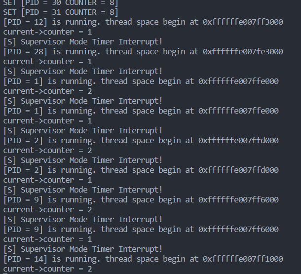
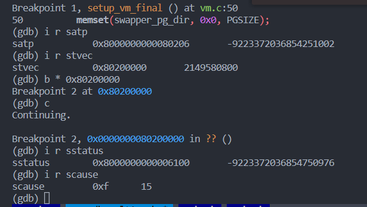

# lab4

## 4.2 开启虚拟内存映射

### 4.2.1 setup_vm 的实现

setup_vm的实现需要实现两个函数，一个是setup_vm，一个是relocate。

对于setup_vm，我们只要实现页表的映射即可。其中`PHY_START >> 30`是去掉后面30位，只留下PPN2，之后再把PPN2放到页表对应的位置上，再加上表示权限的flag位即可。

     

需要注意的是，因为要调用setup_vm，所以要提前设置好sp的值，又因为当我们还未调用relocate的时候，虚拟内存是无法使用的，因此我们要将sp置为boot_stack_up并将其减去`PA2VA_OFFSET`，才算是使用物理内存。

     

之后就是relocate的实现了，注意，由于之前的sp已经被初始化成物理地址，因此在这里要加上`PA2VA_OFFSET`才能转到虚拟地址。之后是设置satp，前4位设置MODE位，之后再把early_pgtbl的物理页号存入后44位。

     

这样，我们的setup_vm就完成了。跑一下，我们可以得到下面的结果。可以看到，程序在虚拟地址上正常运行。

     

### 4.2.2 setup_vm_final 的实现

之后是setup_vm_final的实现。其做的事跟setup_vm实际上差不多，只不过是多映射了一些以及变成了三级页表。

首先，修改mm_init中的值使其malloc对应虚拟地址上的页。这里要注意物理内存只有128M，所以range也只有128M。

     

之后是setup_vm_final的实现。首先，我们将需要的有关kernel段的位置引入进来，注意类型一定要定义为char *。

     

之后是映射的实现。由于我们要映射128M的地址，所以得用循环。text rodata data段的权限各不相同。对于映射的pgtbl，由于先前实现了等值映射，我直接将swapper_pg_dir的物理地址传了进去。

     

注意权限的设置一定要正确，不然qemu就会跳到trap里，scause为0xf。也就是`Store/AMO page fault` - 当试图向一个没有写权限的页写入时产生。

     

这里W置1但是R置0了，导致错误。

     

之后是satp的设置。注意存的一定是物理地址，也可以使用之前实现的csr_write。

     

之后是create_mapping。其传入根页表的地址，并传入要映射的va,pa,sz被固定为PG_SIZE，perm则是权限。 我们首先将每集页表对应的PAGE NUMBER表示出来，再调用get_next_pgtbl_base，返回下级页表的基地址。最后把对应的物理页号放在最后的页表项中。

     

一定要注意的是，页表项R, W, X如果三位都为0，表示是一个指向下一页表的指针。这里我忘记了，导致了之后页表查询没什么反应。

     

最后是get_next_pgtbl_base的实现，我们传入上一级的页表基地址和虚拟页号作为OFFSET，之后check entry的Valid bit，如果是1就返回对应的entry中下一级的页表基地址。如果是0则要kalloc一个新页表，注意一定要存入对应的物理页号，再把这个next_pgtbl传回去。

     

这样，我们的setup_vm_final就实现好了。最后的实现效果如图所示，可以看到与前面是一样的。

     

## 思考题

1. 验证 .text, .rodata 段的属性是否成功设置，给出截图。

可以看对应的table entry后三位，1011是.text 0011是.rodata 0111是其他memory 属性设置是正确的。

     

2. 为什么我们在 setup_vm 中需要做等值映射?

因为这能让我们在虚拟地址上和虚拟地址对应的物理地址上都有kernel代码的映射，为后面setup_vm_final能通过虚拟地址访问物理地址做准备，
而且如果没有等值映射，pc还是跑在低地址，PA!=VA就会导致异常，不能平滑的切换虚拟地址和物理地址。

3. 在 Linux 中，是不需要做等值映射的。请探索一下不在 setup_vm 中做等值映射的方法。

我们可以看`arch/riscv/kernel/head.S`中的`clear_bss_done`段（301行），这是_start_kernel中的一段，其中设置了sp之后，其`call setup_vm`设置初始的页表之后，将early_pg_dir作为参数传入了relocate之中。

     

之后就是relocate的部分。其中第一部分就是加上虚拟地址和物理地址的偏移量。之后就是设置stvec为1f和计算early_pg_dir的虚拟地址。但其先不写入satp，而是先写入trampoline_pg_dir，从而开启mmu。

开启mmu之后直接触发异常进入`1f`，其中设置了stvec是`.Lsecondary_park`，这里就是个死循环，用于debug。继续设置satp为传入的early_pg_table，如果没有触发异常，说明页表设置成功，这样程序就在虚拟地址上跑了。最后返回_start_kernel。

     

