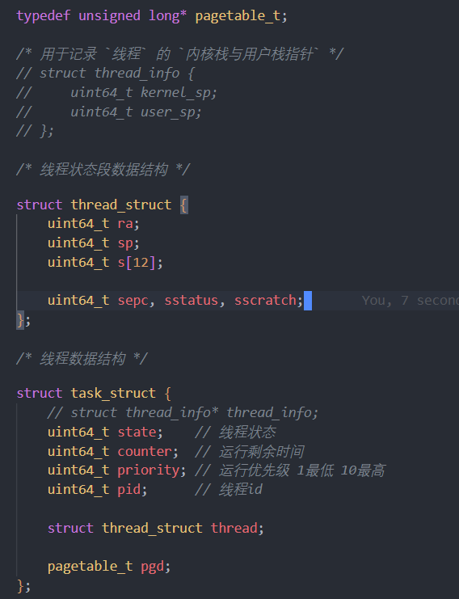
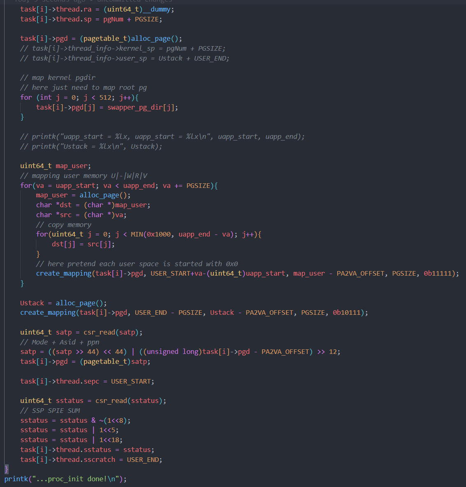

# lab5 RV64 用户态程序

## 4.2 创建用户态进程

首先是按要求将对应的task_struct改掉，我将thread_info删去了。

     

### 4.2.1 修改task_init

之后是改变task_init，其中我们新建一个page来放pgd，之后把根页表各项复制过来，之后是map user memory，我们将每一页的va放到新一页里，再把新页map到USER_START处。之后再新建一个Ustack map到USER_END处，最后是相应CSRreg的改变。

     

由于我们要支持虚拟地址寻址，所以找页表地址时得返回虚拟地址。

     

### 4.2.2 修改__switch_to

对于__switch_to，由于我们的task_struct多了sepc, sscratch, sstatus，所以也要将对应的CSRreg取出或者存入。最后再刷新页表即可。

     

### 4.3 修改中断入口/返回逻辑 ( _trap ) 以及中断处理函数 （ trap_handler ）

首先，修改_dummy，只要将sscratch读出来再和sp对换即可。

     

之后是修改_trap。我们利用sscratch是否为0看是否要对换。

     
     

之后是补充 struct pt_regs的定义， 以及在 trap_handler 中补充处理 SYSCALL 的逻辑。我们直接将pt_reg放到syscall.h之中了。

     
     

### 4.4 添加系统调用

我们创建syscall.c用于系统调用。其中x[17]就是a6，如果是GETPID就返回pid，SYS_WRITE就调用printk解决。注意返回的值改到regs里。

     

之后是对于syscall，要手动将sepc + 4，这是_traps的内容，只要读出scause即可。

     

### 4.5 修改 head.S 以及 start_kernel

这里就比较简单了，只要把对应的部分注释掉即可。不赘述。

### 4.6 测试纯二进制文件

可以看到，我们的counter是按顺序增加而且每个pid都不同。

     

### 4.7 添加 ELF 支持

对于ELF的支持，我们只是将之前的user memory load的部分改成了load_program。

     

之后是load_program的部分，对于phdr_cnt的部分，我们alloc_page拿出对应p_memsz需要的page，注意映射不是从下标0开始，而是对应的vaddr开始，这点很重要。而且对于create_mapping来说，va需要为0x000结尾，这也挺重要的。

     

## 思考题

1. 我们在实验中使用的用户态线程和内核态线程的对应关系是怎样的？（一对一，一对多，多对一还是多 对多）

是多对一的。 

2. 为什么 Phdr 中，p_filesz 和 p_memsz 是不一样大的？

p_filesz 可加载段会多包含一个 .bss 段，这些是未初始化的数据，所以没有必要放在磁盘上。因此它只会在 ELF 文件加载到内存中时才占用空间；所以p_memsz会大于等于p_filesz。

3. 为什么多个进程的栈虚拟地址可以是相同的？用户有没有常规的方法知道自己栈所在的物理地址？ 

因为每个进程的页表都不同，映射到的物理地址也不同的即使虚拟地址相同，也不会相互干扰。照理来说是没有常规方法的，用户既不知道映射规则，也不知道页表信息。

## 实验心得

这次实验对于细节有很多的要求，而且debug也没有之前实验的直观，所以之后很多都是只能靠猜bug的位置。
